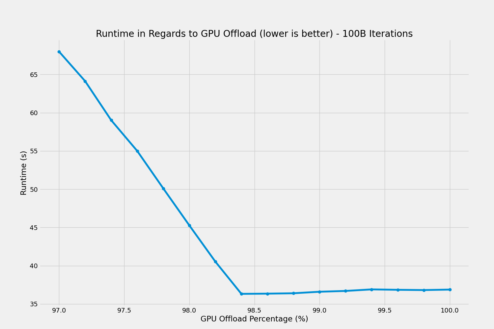
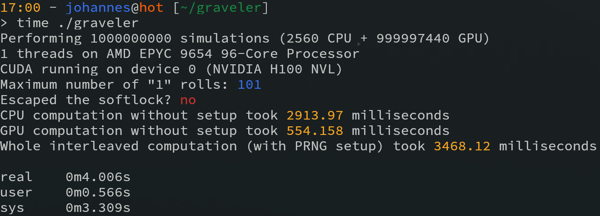

# Graveler Softlock Simulation

[ShoddyCast](https://www.youtube.com/@ShoddyCast) made a video on the insights of
[Pikasprey's Graveler Softlock](https://youtu.be/GgMl4PrdQeo?si=xE0xzHgT_5jclcHb),
challenging others to see how fast one can simulate an attempt at escaping the softlock:

[](https://www.youtube.com/watch?v=M8C8dHQE2Ro)

My attempt includes using GPU-acceleration with CUDA and the cuRAND library for generating random numbers.
Alongside, a (configurable) portion of the iterations are also done multithreaded on the CPU, though the speedup gained from that is pretty negligible.

This can still be improved, for example by using a faster PRNG generator (or by modifying the current one for batch generation).

# Prerequisites

* An NVIDIA GPU with somewhat modern CUDA capabilities
* Proprietary driver installed
* CUDA Toolkit (nvcc, cuRAND, ...)
* make


# Build and Run

```
make
time ./graveler
```

# Results

**~526 milliseconds** of total runtime, **~482 milliseconds** of raw computation (13700K + 4070 Ti SUPER)


Because it's fun, the impact of changing the offloading percentage was investigated:



For my current desktop system, a minimum is reached at ~98.4% GPU-offload, though even after that the runtime penalty is very insignificant.
GPUs are just so much faster for parallel tasks, that you normally don't even put in the effort to balance the jobs for CPU and GPU.

Again, because it's fun, I also threw it on a HPC system with 2x Epyc 9654 and 4x H100 NVL (but only one used):



This is really interesting, just throwing expensive hardware at the problem isn't very effective.
For such small problem sizes, the initialization overhead can be quite big.
It's also really important to optimize the application for the specific hardware (NUMA-affinity, multi-GPU, multi-node, etc...),
but doing so is a topic for another time...
