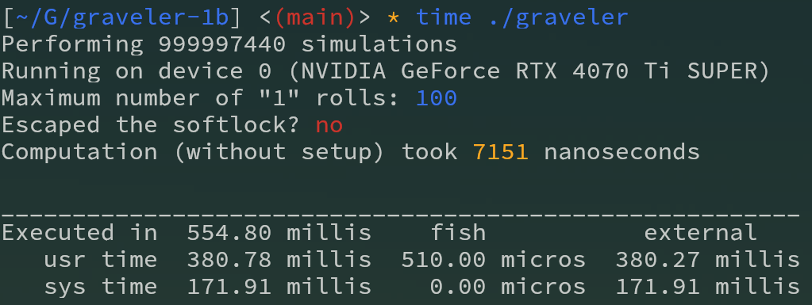

# Graveler Softlock Simulation

[ShoddyCast](https://www.youtube.com/@ShoddyCast) made a video on the insights of
[Pikasprey's Graveler Softlock](https://youtu.be/GgMl4PrdQeo?si=xE0xzHgT_5jclcHb),
challenging others to see how fast one can simulate an attempt at escaping the softlock:

[](https://www.youtube.com/watch?v=M8C8dHQE2Ro)

My attempt includes using GPU-acceleration with CUDA and the cuRAND library for generating random numbers.

This can still be improved, for example by simulating in parallel on the CPU while waiting for the GPU results to come in,
or by using a faster PRNG generator (or by modifying the current one for batch generation).

# Prerequisites

* An NVIDIA GPU with somewhat modern CUDA capabilities
* Proprietary driver installed
* CUDA Toolkit (nvcc, cuRAND, ...)
* make


# Build and Run

```
make
time ./graveler
```

# Results

**~526 milliseconds** of total runtime, **~482 milliseconds** of raw computation (13700K + 4070 Ti SUPER)


